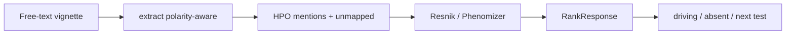

# phenorank

A phenotype-driven ranker that turns a free-text clinical description into an
HPO-constrained candidate gene/disease list with an explanation. Hypothesis
generation, **not** a diagnosis.

[](https://github.com/techiegoku2623/phenorank/actions/workflows/ci.yml)
[](pyproject.toml)
[](LICENSE)

## Status

| Phase | Deliverable | Status |
| --- | --- | --- |
| 0 | Research memo and harnesses | In review — docs/phase-0/research-memo.md |
| 1 | Architecture, schemas, data contracts | Not started |
| 2 | First vertical slice | Not started |
| 3 | Evaluation and demo | Not started |

Status values: Not started / In progress / In review / Merged.

## The problem this solves

Clinicians write paragraphs. Rankers want HPO ids. The gap is not another
similarity formula — Phenomizer already has one — it is polarity, lay
language, and a trail that says which findings drove the list, which
expected findings were absent, and what one more test would change.

A naive extractor treats "no seizures" as a seizure and ranks the wrong
disease first. That is the failure mode this repo exists to catch.

This is research / hypothesis generation. It is not a medical device, not a
diagnosis, and not clinical advice. Every response payload states that a
licensed clinician must review the list. No patient-identifiable data is
used.

## Walkthrough

Phase 0 ships the designed vignettes and the measurement harnesses. The
`phenorank rank` command is reserved for Phase 2; running it now is not
implemented on purpose.

### Step 1 — designed sample set

```bash
make setup && make demo
```

`make demo` calls `phenorank demo-plan`. Actual stdout:

```
phenorank designed sample vignettes

classic.txt  classic
  path:     distinctive phenotypes, top-1 rank
  expected: Polarity-aware ranking places GLUT1 deficiency first. Hypothesis generation, not a diagnosis.

negation.txt  negation
  path:     negation and ruled-out findings
  expected: Naive extraction ranks a seizure/ataxia disease first. Polarity-aware does not; it ranks Prader-Willi first.

nonspecific.txt  nonspecific
  path:     non-specific phenotypes only
  expected: Wide low-confidence set. Output is explicitly insufficient-to-discriminate.

lay.txt  lay
  path:     lay language mapped onto the HPO subset
  expected: floppy baby, small head, and crossed eyes map to hypotonia, microcephaly, and strabismus.

unmapped.txt  unmapped
  path:     term outside the committed HPO subset
  expected: sparkly toenail dystrophy is reported unmapped and is never approximated to a neighbor term.

Hypothesis generation, NOT a diagnosis. Research tool only. This output is not clinical advice and requires review by a licensed clinician.
```

The records are designed: a classic distinctive set, a negation trap, a
non-specific refusal, lay language, and an unmapped term. See
`data/sample/README.md`.

Recordings `demo/01-rank-classic.cast` land in Phase 3.

### Step 2 — distinctive ranking (Phase 2)

```bash
phenorank rank --text-file data/sample/classic.txt --explain
```

Reserved. Sample `classic`. The trail is the product, not the disease name.

### Step 3 — negation (Phase 2)

```bash
phenorank rank --text-file data/sample/negation.txt --explain
```

Reserved. Sample `negation`. Naive extraction ranks the wrong disease first.
Polarity-aware must not.

### Step 4 — insufficient evidence (Phase 2)

```bash
phenorank rank --text-file data/sample/nonspecific.txt
```

Reserved. Output must say insufficient-to-discriminate. A confident
singleton is a bug.

### Step 5 — unmapped term, then the measured baseline

```bash
phenorank rank --text-file data/sample/unmapped.txt
make eval
```

`phenorank rank` on `unmapped` is reserved (report unmapped, never
approximate). `make eval` already runs: it regenerates `docs/EVALUATION.md`
from the Phase 0 harnesses.

## Layout

Read in this order:

1. `docs/phase-0/research-memo.md` — why polarity-aware + which similarity
2. `data/sample/README.md` — why each demo vignette exists
3. `src/phenorank/extract.py` — lexicon + negation/uncertainty rules
4. `src/phenorank/similarity.py` — Resnik and Phenomizer-style only
5. `research/phase0/` — the three measurements behind the memo
6. `src/phenorank/cli.py` — demo-plan only, until Phase 2

## Results

Regenerated by `make eval`. Baseline column is mandatory.

<!-- EVAL_TABLE_BEGIN -->

| System | Result | n | Notes |
| --- | --- | --- | --- |
| Naive extractor (baseline) | negated F1 0.000 | 50 | All mentions labeled positive |
| Polarity-aware extractor | negated F1 1.000 | 50 | Rules + committed lexicon |
| Resnik ranking | top-1 0.955 | 22 | Asymmetric mean-best IC |
| Phenomizer-style ranking | top-1 0.955 | 22 | Symmetric Resnik |
| Harsh noise cell | top-1 0.545 | 11 diseases | 50% drop + 2 noise terms |

<!-- EVAL_TABLE_END -->

## 🏗️ Architecture & Event Topology



`ExtractionResult` and `RankResponse` always include the hypothesis-generation
disclaimer. A term not in the committed subset is unmapped, never guessed.

## ⚖️ Architecture Trade-offs & Pragmatic Decisions

| Chosen | Given up | What would change the answer |
| --- | --- | --- |
| Committed toy HPO + 10 profiles | Live HPO/OMIM dump | A Phase 3 annotation file that reproduces the measure gap |
| Rules + lexicon extractor | Live LLM extraction | Live-note F1 where rules lose to a cached model |
| Resnik and Phenomizer-style only | A third invented similarity | A labeled hold-out where a third measure wins and is cited |
| Designed vignettes | Clinic notes | IRB corpus |
| No live API | Fresh HPO sync | Dated release ingest with a manifest |

## 🛡️ Edge Cases & Failure Modes

- "No seizures" / "ruled out ataxia": naive ranks GLUT1-like first; polarity-aware must not.
- Only GDD + failure to thrive: `insufficient_to_discriminate`.
- Lay phrases (`floppy baby`, `small head`, `crossed eyes`) must hit the subset.
- `sparkly toenail dystrophy` is unmapped and is not aliased to a skin term.
- Uncertain mentions (`possible ataxia`) do not enter the positive query set.
- A term outside `hpo_subset.json` is never emitted as an HPO id.

## Limitations

This is not a diagnosis. It does not replace a clinical geneticist. Phase 0
ranks designed vignettes against a toy ontology, not patients. No demo
recording is committed. Live HPO accuracy is unmeasured.

## License and citation

MIT. Cite Köhler et al., Am J Hum Genet 2009;85:457-464 for the Phenomizer
measure, Resnik 1995 for information content, and this repository for the
engine. Cite HPO when using the production ontology.
