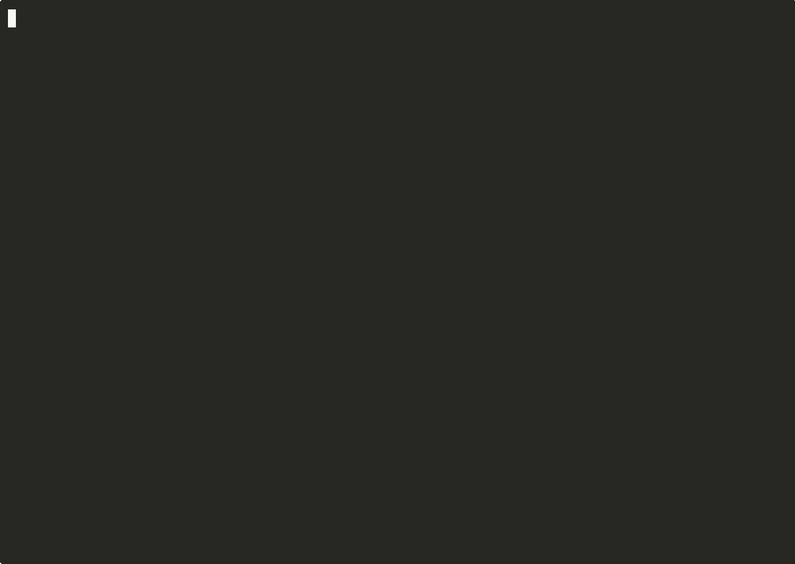
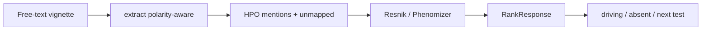

# phenorank

A phenotype-driven ranker that turns a free-text clinical description into an
HPO-constrained candidate gene/disease list with an explanation. Hypothesis
generation, **not** a diagnosis.

[](https://github.com/techiegoku2623/phenorank/actions/workflows/ci.yml)
[](pyproject.toml)
[](LICENSE)




Regenerable terminal video: `make record`. [Full mp4](demo/out/phenorank-demo.mp4). Per-shot loops live in `demo/out/`. See `demo/README.md`.

## Status

| Phase | Deliverable | Status |
| --- | --- | --- |
| 0 | Research memo and harnesses | Merged |
| 1 | Architecture, schemas, data contracts | Merged — docs/ARCHITECTURE.md |
| 2 | First vertical slice | Merged |
| 3 | Evaluation and demo | Merged |

Status values: Not started / In progress / In review / Merged.

## The problem this solves

Clinicians write paragraphs. Rankers want HPO ids. The gap is not another
similarity formula — Phenomizer already has one — it is polarity, lay
language, and a trail that says which findings drove the list, which
expected findings were absent, and what one more test would change.

A naive extractor treats "no seizures" as a seizure and ranks the wrong
disease first. That is the failure mode this repo exists to catch.

This is research / hypothesis generation. It is not a medical device, not a
diagnosis, and not clinical advice. Every response payload states that a
licensed clinician must review the list. No patient-identifiable data is
used. No credentials are required.

## Walkthrough

`make demo` is the full Phase 3 walkthrough. Actual stdout from this
environment (PATH includes `$HOME/.local/bin`):

```
=== phenorank extract classic ===
uv run phenorank extract --vignette data/sample/classic.txt
Hypothesis generation, NOT a diagnosis. Research tool only. This output is not clinical advice and requires review by a licensed clinician.

extracted HPO mentions (committed subset only)

  HP:0001250    positive    Seizure                   surface='seizures'
  HP:0001251    positive    Ataxia                    surface='ataxia'
  HP:0000252    positive    Microcephaly              surface='microcephaly'
  HP:0001263    positive    Global developmental delay  surface='global developmental delay'
  HP:0001332    positive    Dystonia                  surface='dystonia'

unmapped: (none)

positive=['HP:0001250', 'HP:0001251', 'HP:0000252', 'HP:0001263', 'HP:0001332']
negated=[]
uncertain=[]

Hypothesis generation, NOT a diagnosis. Research tool only. This output is not clinical advice and requires review by a licensed clinician.

=== phenorank rank classic --explain ===
uv run phenorank rank --vignette data/sample/classic.txt --explain
Hypothesis generation, NOT a diagnosis. Research tool only. This output is not clinical advice and requires review by a licensed clinician.

measure: phenomizer
insufficient_to_discriminate: False
Distinctive phenotypes support a ranked hypothesis list, not a diagnosis.

ranked candidates (hypothesis list, not a diagnosis)

   1.  1.179  OMIM:606777             GLUT1 deficiency syndrome
      driving:              HP:0001250 Seizure; HP:0001251 Ataxia; HP:0000252 Microcephaly; HP:0001263 Global developmental delay; HP:0001332 Dystonia
      expected-but-absent:  HP:0001290 Generalized hypotonia
      next test:            neurology exam for dystonia would change the ranking.
   2.  0.798  OMIM:105830             Angelman syndrome
      driving:              HP:0001250 Seizure; HP:0001251 Ataxia; HP:0000252 Microcephaly; HP:0001263 Global developmental delay
      expected-but-absent:  HP:0000733 Stereotypical behavior
      next test:            exam for stereotypies would change the ranking.
   3.  0.609  OMIM:312750             Rett syndrome
      driving:              HP:0001250 Seizure; HP:0000252 Microcephaly
      expected-but-absent:  HP:0002376 Developmental regression; HP:0000733 Stereotypical behavior
      next test:            developmental history for regression would change the ranking.
   4.  0.565  SYN:mito-enceph         Mitochondrial encephalopathy (toy profile)
      driving:              HP:0001250 Seizure; HP:0001251 Ataxia; HP:0001263 Global developmental delay
      expected-but-absent:  HP:0001290 Generalized hypotonia; HP:0003128 Lactic acidosis; HP:0001638 Cardiomyopathy
      next test:            serum lactate would change the ranking.
   5.  0.487  SYN:seizure-ataxia-trap  Seizure-ataxia trap profile
      driving:              HP:0001250 Seizure; HP:0001251 Ataxia
      expected-but-absent:  HP:0001290 Generalized hypotonia; HP:0011968 Feeding difficulties
      next test:            Testing for Feeding difficulties (HP:0011968) would change the ranking.
   6.  0.403  SYN:GDD-nonspecific     Nonspecific developmental delay profile
      driving:              HP:0001263 Global developmental delay
      expected-but-absent:  (none)
      next test:            Testing for Failure to thrive (HP:0001508) would change the ranking.
   7.  0.349  OMIM:176270             Prader-Willi syndrome
      driving:              HP:0001263 Global developmental delay
      expected-but-absent:  HP:0001290 Generalized hypotonia; HP:0011968 Feeding difficulties
      next test:            Testing for Feeding difficulties (HP:0011968) would change the ranking.
   8.  0.212  SYN:cong-myopathy       Congenital myopathy (toy profile)
      driving:              (none)
      expected-but-absent:  HP:0001290 Generalized hypotonia; HP:0001324 Muscle weakness; HP:0011968 Feeding difficulties
      next test:            CK / muscle evaluation would change the ranking.

Hypothesis generation, NOT a diagnosis. Research tool only. This output is not clinical advice and requires review by a licensed clinician.

=== phenorank rank negation --compare-naive ===
uv run phenorank rank --vignette data/sample/negation.txt --compare-naive
Hypothesis generation, NOT a diagnosis. Research tool only. This output is not clinical advice and requires review by a licensed clinician.

side-by-side ranking: polarity-aware vs naive (all mentions positive)

rank  aware id                aware name                          naive id                naive name
1     OMIM:176270             Prader-Willi syndrome               SYN:seizure-ataxia-trap Seizure-ataxia trap profile
2     SYN:cong-myopathy       Congenital myopathy (toy profile)   OMIM:176270             Prader-Willi syndrome
3     SYN:GDD-nonspecific     Nonspecific developmental delay profileSYN:cong-myopathy       Congenital myopathy (toy profile)
4     OMIM:163950             Noonan syndrome                     OMIM:606777             GLUT1 deficiency syndrome
5     OMIM:162200             Neurofibromatosis type 1            SYN:mito-enceph         Mitochondrial encephalopathy (toy profile)
6     SYN:seizure-ataxia-trap Seizure-ataxia trap profile         OMIM:105830             Angelman syndrome
7     OMIM:312750             Rett syndrome                       SYN:GDD-nonspecific     Nonspecific developmental delay profile
8     OMIM:606777             GLUT1 deficiency syndrome           OMIM:312750             Rett syndrome

polarity-aware top-1: OMIM:176270  Prader-Willi syndrome
naive top-1:          SYN:seizure-ataxia-trap  Seizure-ataxia trap profile
top-1 differs:        true

Distinctive phenotypes support a ranked hypothesis list, not a diagnosis.

Hypothesis generation, NOT a diagnosis. Research tool only. This output is not clinical advice and requires review by a licensed clinician.

=== phenorank rank nonspecific ===
uv run phenorank rank --vignette data/sample/nonspecific.txt
Hypothesis generation, NOT a diagnosis. Research tool only. This output is not clinical advice and requires review by a licensed clinician.

measure: phenomizer
insufficient_to_discriminate: True
Insufficient to discriminate: only non-specific phenotypes, wide low-confidence set.

ranked candidates (hypothesis list, not a diagnosis)

   1.  1.247  SYN:GDD-nonspecific     Nonspecific developmental delay profile
   2.  0.676  OMIM:163950             Noonan syndrome
   3.  0.616  OMIM:176270             Prader-Willi syndrome
   4.  0.451  SYN:seizure-ataxia-trap  Seizure-ataxia trap profile
   5.  0.396  OMIM:606777             GLUT1 deficiency syndrome
   6.  0.396  OMIM:105830             Angelman syndrome
   7.  0.342  SYN:mito-enceph         Mitochondrial encephalopathy (toy profile)
   8.  0.329  OMIM:162200             Neurofibromatosis type 1

Hypothesis generation, NOT a diagnosis. Research tool only. This output is not clinical advice and requires review by a licensed clinician.

=== phenorank extract unmapped ===
uv run phenorank extract --vignette data/sample/unmapped.txt
Hypothesis generation, NOT a diagnosis. Research tool only. This output is not clinical advice and requires review by a licensed clinician.

extracted HPO mentions (committed subset only)

  HP:0001290    positive    Generalized hypotonia     surface='hypotonia'

unmapped (reported, not approximated to a neighbor term):
  - sparkly toenail dystrophy

positive=['HP:0001290']
negated=[]
uncertain=[]

Hypothesis generation, NOT a diagnosis. Research tool only. This output is not clinical advice and requires review by a licensed clinician.
```

Then `make eval` (top-1/5/20, MRR, overlap-count baseline, noise curve). Recordings:

- `demo/01-extract-polarity.cast`
- `demo/02-negation-comparison.cast`
- `demo/03-uncertainty-and-eval.cast`

Optional research API: `phenorank serve` then `POST /rank` with
`{"vignette": "..."}`. No credentials.

## Layout

Read in this order:

1. `docs/ARCHITECTURE.md` — contracts and CLI
2. `docs/phase-0/research-memo.md` — why polarity-aware + which similarity
3. `data/sample/README.md` — why each demo vignette exists
4. `src/phenorank/extract.py` — lexicon + negation/uncertainty rules
5. `src/phenorank/similarity.py` — Resnik and Phenomizer-style only
6. `src/phenorank/rank.py` — explanation trail
7. `research/phase0/` — the measurements behind the memo

## Results

Regenerated by `make eval`. Baseline column is mandatory.

<!-- EVAL_TABLE_BEGIN -->

| System | Result | n | Notes |
| --- | --- | --- | --- |
| Naive extractor (baseline) | negated F1 0.000 | 50 | All mentions labeled positive |
| Polarity-aware extractor | negated F1 1.000 | 50 | Rules + committed lexicon |
| Overlap-count ranking (baseline) | top-1 0.955; MRR 0.977 | 22 | Shared-term count |
| Resnik ranking | top-1/5/20 0.955/1.000/1.000; MRR 0.977 | 22 | Asymmetric mean-best IC |
| Phenomizer-style ranking | top-1/5/20 0.955/1.000/1.000; MRR 0.970 | 22 | Symmetric Resnik |
| Harsh noise cell | top-1 0.545 | 11 diseases | 50% drop + 2 noise terms |

<!-- EVAL_TABLE_END -->

## 🏗️ Architecture & Event Topology



`ExtractionResult` and `RankResponse` always include the hypothesis-generation
disclaimer. A term not in the committed subset is unmapped, never guessed.

## ⚖️ Architecture Trade-offs & Pragmatic Decisions

| Chosen | Given up | What would change the answer |
| --- | --- | --- |
| Committed toy HPO + 10 profiles | Live HPO/OMIM dump | A dated public annotation file that reproduces the measure gap |
| Rules + lexicon extractor | Live LLM extraction | Live-note F1 where rules lose to a cached model |
| Resnik and Phenomizer-style only | A third invented similarity | A labeled hold-out where a third measure wins and is cited |
| Overlap-count as eval baseline | Shipping overlap as the ranker | Overlap beating Phenomizer on a hold-out |
| Designed vignettes | Clinic notes | IRB corpus |
| Optional stdlib POST /rank | FastAPI stack | Need for OpenAPI clients |

## 🛡️ Edge Cases & Failure Modes

- "No seizures" / "ruled out ataxia": naive ranks a seizure/ataxia profile first; polarity-aware ranks Prader-Willi first.
- Only GDD + failure to thrive: `insufficient_to_discriminate`.
- Lay phrases (`floppy baby`, `small head`, `crossed eyes`) must hit the subset.
- `sparkly toenail dystrophy` is unmapped and is not aliased to a skin term.
- Uncertain mentions (`possible ataxia`) do not enter the positive query set.
- A term outside `hpo_subset.json` is never emitted as an HPO id.

## Limitations

This is not a diagnosis. It does not replace a clinical geneticist. Ranking
is against a toy ontology, not patients. Live HPO accuracy is unmeasured.

## License and citation

MIT. Cite Köhler et al., Am J Hum Genet 2009;85:457-464 for the Phenomizer
measure, Resnik 1995 for information content, and this repository for the
engine. Cite HPO when using the production ontology.
